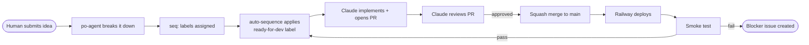
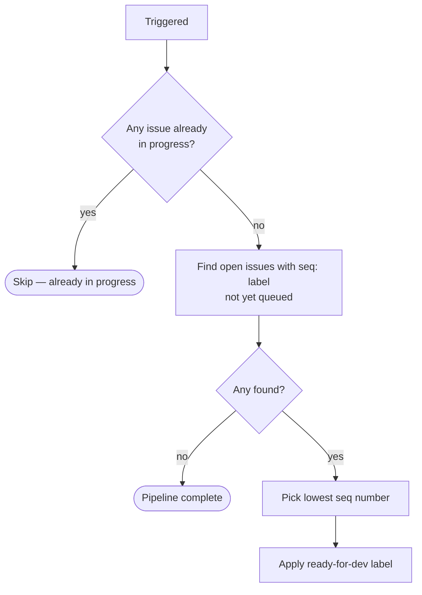
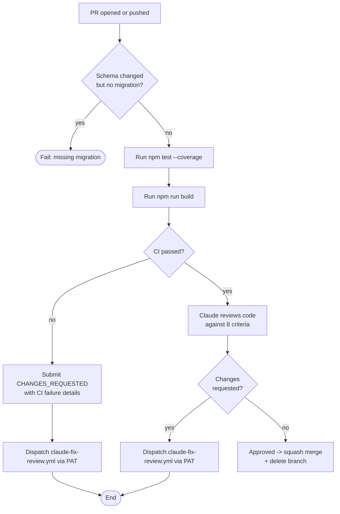
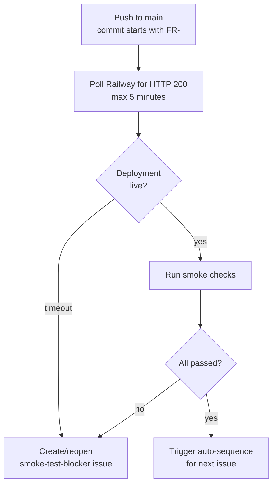
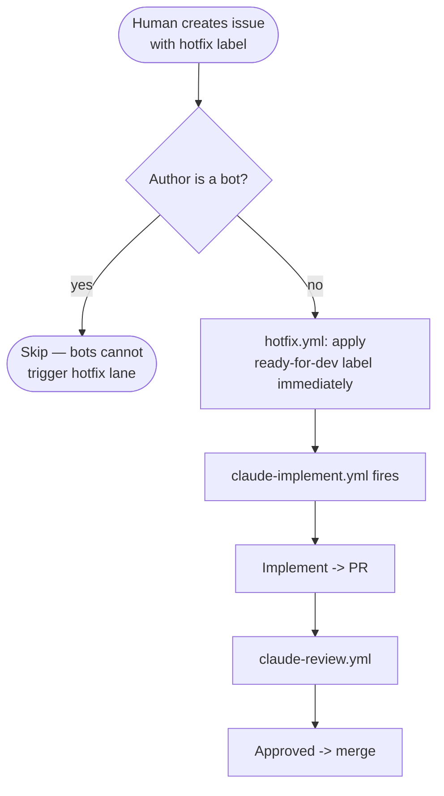
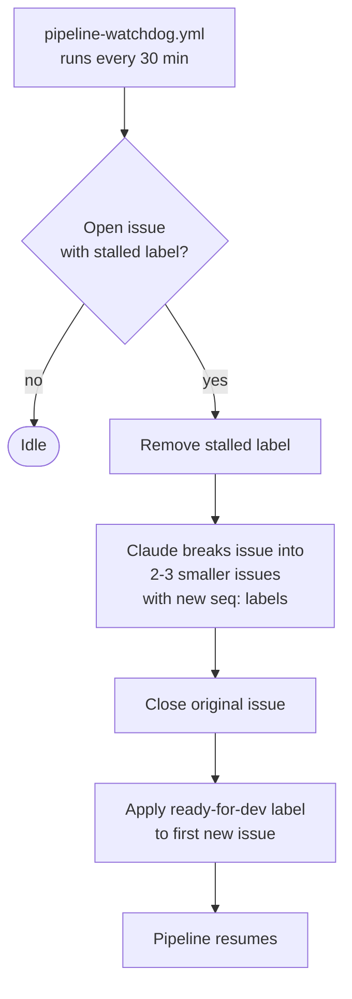

# Agentic Development Pipeline

This repo uses a fully autonomous GitHub Actions pipeline to take raw feature ideas from issue creation through implementation, code review, and production deployment — all without human intervention beyond the initial idea submission.

---

## Overview



There are two lanes: the **normal lane** (sequenced feature work) and the **hotfix lane** (expedited production bugs). Both converge at the implement -> review -> deploy cycle.

---

## Workflows at a Glance

| Workflow | File | Trigger |
|---|---|---|
| PO Agent | `po-agent.yml` | `po-agent` label applied to an issue |
| Auto-Sequence | `auto-sequence.yml` | `workflow_dispatch`, or `seq:` label applied |
| Implement | `claude-implement.yml` | `ready-for-dev` label applied to an issue |
| Code Review | `claude-review.yml` | PR opened/updated against `main` on a `feature/issue-*` branch |
| Fix Review Feedback | `claude-fix-review.yml` | `workflow_dispatch` (dispatched by code review) |
| Resolve Conflicts | `claude-resolve-conflicts.yml` | `workflow_dispatch` |
| Auto Merge | `claude-auto-merge.yml` | PR review submitted (approved) on a `feature/issue-*` branch |
| Pipeline Watchdog | `pipeline-watchdog.yml` | Schedule: every 30 minutes |
| Retry Usage-Limited | `claude-retry.yml` | Schedule: daily 4:05pm UTC |
| Post-Deploy Smoke Test | `post-deploy-smoketest.yml` | Push to `main` where commit message starts with `[FR-` |
| Sync Main -> Features | `sync-main-to-features.yml` | Push to `main` |
| Sync Feature Flags | `sync-feature-flags.yml` | Push to `main` |
| Security Audit | `security.yml` | Push or PR to `main` |
| Hotfix Assignment | `hotfix.yml` | `hotfix` label applied, or issue opened with `hotfix` label |

---

## Normal Lane — Feature Pipeline

### Step 1: Submit a Raw Idea

Create a GitHub issue with any description and apply the `po-agent` label.

### Step 2: PO Agent Breaks It Down (`po-agent.yml`)

Claude reads the issue, scans the codebase, and creates 1–3 implementable sub-issues — each covering exactly one layer (schema-only, API-only, or UI-only). It assigns each a `seq:N` label (N in the range 1–50, wrapping after 50), then closes the raw idea issue.

**Seq label rules:**
- Labels are bounded to `seq:1` through `seq:50`
- The next seq is `(max_open_seq % 50) + 1`
- A new `seq:N` GitHub label is created if it doesn't exist

Applying a `seq:` label also triggers `auto-sequence.yml` immediately so newly created issues are picked up without waiting for the next deploy.

### Step 3: Auto-Sequence Assigns the Next Issue (`auto-sequence.yml`)



A concurrency lock (`group: auto-sequence`) prevents two runs from racing to assign simultaneously.

### Step 4: Claude Implements (`claude-implement.yml`)

Fires when the `ready-for-dev` label is applied to an issue. Claude:

1. Reads `CLAUDE.md` for project conventions
2. Implements exactly what the issue describes
3. Runs `npm run build` and `npm run lint` — fixes errors before continuing
4. Runs `npm test -- --coverage` — achieves >80% coverage on new files
5. Creates branch `feature/issue-<N>`
6. Pushes and opens a PR targeting `main`

If the workflow fails (bun crash, API error, etc.), the `stalled` label is applied so the pipeline doesn't silently freeze.

### Step 5: Automated Code Review (`claude-review.yml`)



> **Why the PAT for dispatch?** Reviews submitted via `GITHUB_TOKEN` (github-actions[bot]) cannot trigger other workflows — a GitHub security restriction. The fix workflow is dispatched using `CLAUDE_PIPELINE_TOKEN` so that `claude-fix-review.yml` actually fires.

**Review criteria Claude enforces:**
1. Correctness — matches the linked issue
2. Conventions — follows `CLAUDE.md` (auth checks, no `any`, transactions)
3. Security — no exposed secrets, no missing auth
4. Feature flags — `lib/flags.ts` must not be modified; no `isEnabled()` calls added
5. Tests — every new API route must have tests in `__tests__/api/`
6. Test quality — tests must assert behaviour, not just return codes
7. Types — no implicit `any`
8. Simplicity — no scope creep

### Step 6: Fix Review Feedback (`claude-fix-review.yml`)

Claude reads the CHANGES_REQUESTED review summary and inline comments, applies fixes to the existing branch, then pushes. This triggers a new `claude-review.yml` run, restarting the review cycle.

A `concurrency` guard on `claude-review.yml` (`group: review-<PR number>`) cancels any in-flight review when a new commit arrives, preventing two review runs from both reaching the "fix or merge" decision.

### Step 7: Merge and Deploy

On squash merge to `main`, Railway automatically deploys. The squash commit message is set to the PR title only — no `Co-Authored-By` lines — so Railway correctly identifies the commit author for deploy filtering.

### Step 8: Post-Deploy Smoke Test (`post-deploy-smoketest.yml`)



**Smoke checks:**
- `/sign-in` returns HTTP 200 (app shell loads)
- `/api/goals`, `/api/log`, `/api/feed` return 401 unauthenticated (Clerk wired)
- `/api/smoke` (with secret header) returns 200 — deep check: DB connectivity + column presence

If smoke fails, a standing issue labelled `smoke-test-blocker` is created (or reopened if it already exists). This pauses the sequence until production is healthy again.

---

## Hotfix Lane

For production bugs that need to skip the seq queue entirely.



The bot guard (`github.event.issue.user.type != 'Bot'`) prevents Sentry alerts and similar automated issues from accidentally entering the pipeline with empty bodies.

The hotfix workflow fires on both `labeled` (label added to existing issue) and `opened` (issue created with `hotfix` label already applied) events.

---

## Failure Recovery

### Stalled Issues (Watchdog)

If `claude-implement.yml` exhausts its 60-turn budget without producing a PR, the `stalled` label is applied. The watchdog runs every 30 minutes.



### Usage-Limited Failures (Daily Retry)

`claude-retry.yml` runs at 4:05pm UTC daily (just after Claude Code Pro usage resets). It scans failed implement runs from the last 24 hours, checks their logs for usage-limit error messages, and re-dispatches `claude-implement.yml` for any that failed due to quota exhaustion.

### Transient Infrastructure Failures

Bun runtime crashes, GitHub API timeouts, and similar transient failures apply the `stalled` label just like turn-budget exhaustion. The watchdog handles these the same way — except the original issue body is often fine as-is, so it may be re-issued without splitting.

---

## Supporting Workflows

### Sync Main Into Feature Branches (`sync-main-to-features.yml`)

On every push to `main`, merges `main` into any open `feature/issue-*` PRs. Prevents large drift between long-running feature branches and main.

### Auto Merge on Approval (`claude-auto-merge.yml`)

Backup merge path. If any reviewer manually approves a `feature/issue-*` PR, this workflow squash-merges it immediately using the GitHub API directly (not `gh pr merge --squash`) to produce a clean commit message without `Co-Authored-By` lines. This is distinct from the merge inside `claude-review.yml` — it handles cases where a human reviews a PR directly on GitHub.

### Resolve Merge Conflicts (`claude-resolve-conflicts.yml`)

Dispatched manually when a feature branch has accumulated conflicts against `main`. Claude reads the conflicted files, resolves them, and pushes to the branch. Triggers a new `claude-review.yml` run.

### Sync Feature Flags to Railway (`sync-feature-flags.yml`)

On every push to `main`, detects newly added `isEnabled('FLAG_NAME')` calls in the diff and registers `FF_FLAG_NAME=false` as a Railway environment variable. This ensures new flags show up in the Railway dashboard ready to enable without manual setup.

### Security Audit (`security.yml`)

Runs `npm audit --audit-level=high` on every push and PR to `main`.

---

## Key Secrets and Tokens

| Secret | Used by | Purpose |
|---|---|---|
| `CLAUDE_CODE_OAUTH_TOKEN` | All Claude Code action steps | Authenticates with Anthropic to run Claude |
| `CLAUDE_PIPELINE_TOKEN` | Push, PR creation, dispatch, issue ops, merge | PAT used by the pipeline for all GitHub write operations |
| `SMOKE_TEST_SECRET` | `post-deploy-smoketest.yml` | Header secret for `/api/smoke` deep check |
| `RAILWAY_TOKEN` | `sync-feature-flags.yml` | Railway CLI authentication |

> `GITHUB_TOKEN` (automatic) is used for read operations and for submitting PR reviews — its limited scope prevents it from triggering downstream workflows, which is why `CLAUDE_PIPELINE_TOKEN` is used for all `workflow_dispatch` calls.

---

## End-to-End Example

```
Human -> creates issue "Add steps goal" -> applies po-agent label
  |
po-agent.yml
  -> creates #101 "Schema: add stepsGoal to User" (seq:15)
  -> creates #102 "API: GET/POST /api/goals/steps" (seq:16)
  -> creates #103 "UI: steps goal card on dashboard" (seq:17)
  -> closes raw idea

auto-sequence.yml (triggered by seq:15 label)
  -> applies ready-for-dev label to #101

claude-implement.yml (#101)
  -> edits prisma/schema.prisma, writes migration SQL
  -> opens PR #104

claude-review.yml (PR #104)
  -> tests pass, build passes
  -> Claude approves -> squash merges -> branch deleted

post-deploy-smoketest.yml
  -> Railway deploys, smoke passes
  -> triggers auto-sequence.yml -> applies ready-for-dev to #102

... repeat for #102 and #103 ...

All three issues merged -> feature live in production
```
